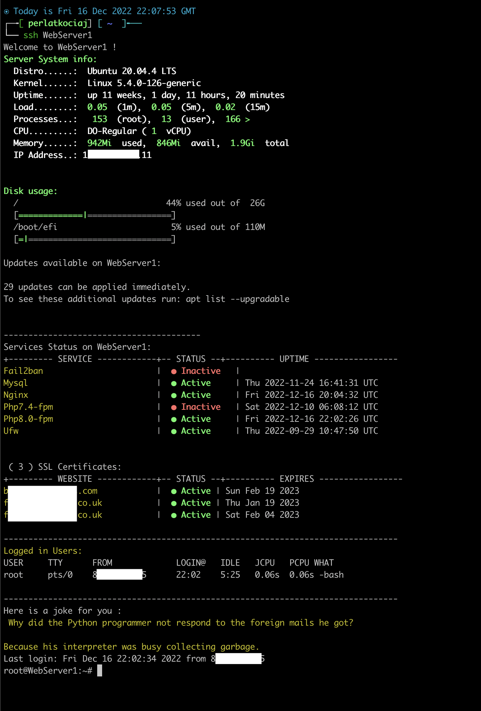

# PK Welcome Message
MOTD scripts for a typical LEMP Server and not only.

| Default | With Updated PK MOTD |
| --- | --- |
|  |  |

# How To Install

SSh into the server you want to install and type the following command
> `wget -O - https://raw.githubusercontent.com/perlatsp/pk-motd/main/install.sh | bash`

OR manually install it:
- Download `custom-welcome-message.txt'
- Renate to `custom-welcome-message` or another name you prefer
- Set permissions
    - `sudo chmod -x etc/update-motd.d/*` Optional but recomended to disable the default motd files
    - `sudo chmod 755 /etc/update-motd.d/custom-welcome-message` to make the file executable
## Features
- [x] System Information
    - [x] Name
    - [x] Uptime
    - [x] Load
    - [x] Processes
    - [x] Memory
    - [x] IP Addresses
- [x] Disk Usage Graph
- [x] Available Updates
- [x] Services Status ( can be changed )
    - [x] Fail2Ban
    - [x] MySQL
    - [x] PHP FPM
    - [x] NGINX
    - [x] UFW
- [x] Domain Certificates Status and Expiry date
- [x] Logged in users
- [x] Developer Jokes 😂 🤓